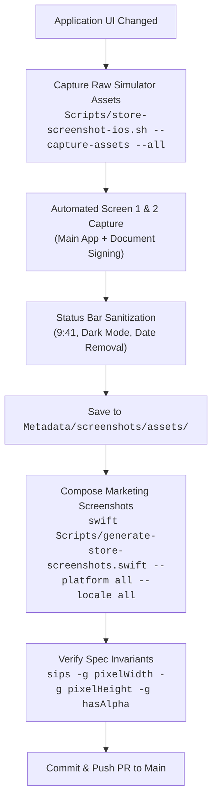

# App Store Screenshot Design System & Generation Pipeline

This document defines the architecture, design principles, mathematical geometry, and operational procedures for producing App Store marketing screenshots for RefineID on macOS, iOS, and iPadOS.

For the practical operator runbook and command cheat sheet, see [`Metadata/screenshots/README.md`](../Metadata/screenshots/README.md).

---

## 1. Design Rationale and Philosophy

Raw device screenshots without framing or context underperform in conversion on the App Store:
- They lack clear value propositions explaining *why* the citizen needs this app.
- Status bar artifacts (varying battery percentages, random clock times, carrier names) introduce visual noise and look unpolished.
- iPad simulator status bars show localized calendar dates (e.g. `Sat 26. Sep`) which make screenshots age immediately.
- Bottom areas of many application screens contain dead space or secondary controls that distract from the main functional flow.

RefineID employs a **framed marketing presentation model**:
1. **Curated Wallpaper Canvas**: Official Golden Gate dark wallpaper creates a premium, unified brand aesthetic across all Apple platforms.
2. **Gradient Top Veil**: An upper dark linear gradient (`0.90 -> 0.50 -> 0.0` alpha) provides high contrast for typography regardless of underlying wallpaper brightness.
3. **Hardware-Accurate Device Bezels**: Metallic dark device bezels, 1.5 pt highlight strokes, and deep ambient drop shadows evoke a physical device in the user's hand.
4. **Top-Anchored Visual Alignment**: Headlines across carousel slides begin at the exact same horizontal baseline, eliminating vertical jumping when users swipe through the store.
5. **Screen Bottom Bleed / Cropping**: Trimming non-essential lower areas elevates the primary card and document signing interfaces, eliminating wasted space.

---

## 2. Technical Specifications & Gate Invariants

Every file generated under `Metadata/screenshots/` must strictly pass App Store Connect submission requirements:

| Invariant | Specification | Verification Method |
| :--- | :--- | :--- |
| **Alpha Channel** | **Strictly 0% alpha (`hasAlpha: no`)** | `sips -g hasAlpha <file>` must return `no` |
| **Color Space** | **sRGB IEC61966-2.1** | Built using `CGColorSpace(name: CGColorSpace.sRGB)` |
| **Bit Depth** | **8 bits per channel (24/32-bit pixel)** | `CGImageAlphaInfo.noneSkipLast` |
| **macOS Canvas** | **2880 × 1800 px** (`APP_DESKTOP`) | Exact 16:10 aspect ratio |
| **iPhone Canvas** | **1290 × 2796 px** (`APP_IPHONE_67`) | Exact iPhone 6.7″ / 6.9″ portrait |
| **iPad Canvas** | **2048 × 2732 px** (`APP_IPAD_PRO_3GEN_129`)| Exact iPad Pro 12.9″ / 13″ portrait |
| **Status Bar Time**| **9:41** | `simctl status_bar override --time 9:41` |
| **Status Bar Battery** | **100% charged** | `simctl status_bar override --batteryState charged` |
| **iPad Date Sanitization** | **Timeless clock only** | Programmatically patched status bar date area |
| **Diagnostics Suppression**| **No debug UI** | Launch argument `--hide-diagnostics` |
| **Data Privacy** | **Synthetic data only** | Virtual card identities (`ESIMERKKI ERJA`) |

---

## 3. Spatial Geometry & Harmonized Layout Metrics

The rendering engine ([`Scripts/generate-store-screenshots.swift`](../Scripts/generate-store-screenshots.swift)) implements a top-anchored layout algorithm.

### iOS (`APP_IPHONE_67`, 1290 × 2796)

```swift
let titleTopMargin: CGFloat = 236
let titleToSubGap: CGFloat = titleHeight > 150 ? 56 : 64
let phoneY: CGFloat = titleHeight > 150 ? 250 : 330

let rawCropHeight: CGFloat = 1920
let targetWidth: CGFloat = 1160
let targetHeight = targetWidth * (rawCropHeight / 1290.0) // ~1726.5 px
let cornerRadius: CGFloat = 56.0
```

- **Top-Anchoring**: The top edge of the title is placed at `height - titleTopMargin` (`2796 - 236 = 2560 px`). Both 1-line and 2-line titles share this top starting level.
- **Rhythm Gap Continuity**:
  - For Slide 01 (2-line title, `height ≈ 222 px`): `subToCardGap ≈ 169.5 px`, with `phoneY = 250 px`.
  - For Slide 02 (1-line title, `height ≈ 127 px`): `subToCardGap ≈ 176.5 px`, with `phoneY = 330 px`.
  - The gap from subtitle to card is perceptually identical (~170–176 px), maintaining harmony.

### iPadOS (`APP_IPAD_PRO_3GEN_129`, 2048 × 2732)

```swift
let titleTopMargin: CGFloat = 280
let titleToSubGap: CGFloat = titleHeight > 200 ? 64 : 72
let ipadY: CGFloat = titleHeight > 200 ? 520 : 580

let rawCropHeight: CGFloat = 1340
let targetWidth: CGFloat = 1860
let targetHeight = targetWidth * (rawCropHeight / 2048.0) // ~1217 px
let cornerRadius: CGFloat = 44.0
```

- **Top-Anchoring**: Title headline begins at `2732 - 280 = 2452 px`.
- **Rhythm Gap Continuity**:
  - Slide 01: `subToCardGap ≈ 273 px`, with `ipadY = 520 px`.
  - Slide 02: `subToCardGap ≈ 263 px`, with `ipadY = 580 px`.

---

## 4. Operational Workflow: Updating Screenshots for New Outlooks

When application visuals, fonts, views, or themes change in the future, follow this runbook to update all screenshots:



### Step 1: Simulator Asset Capture
Run:
```sh
Scripts/store-screenshot-ios.sh --capture-assets --all
```
This automatically boots the iPhone and iPad simulators, sets pristine status bars, builds and installs the app, launches each localized scenario for Screen 01 and Screen 02, sanitizes the iPad status bar date, saves raw PNGs into `Metadata/screenshots/assets/`, and automatically triggers `generate-store-screenshots.swift`.

### Step 2: macOS Window Capture
If the macOS interface changed:
1. Launch macOS RefineID in Debug mode:
   ```sh
   build/Build/Products/Debug/RefineID.app/Contents/MacOS/RefineID --hide-diagnostics --mock-remote-connected --virtual-card registered-nfc -AppleLanguages '(fi)' -AppleLocale fi
   ```
2. Capture the window:
   ```sh
   Scripts/store-screenshot.sh window-card-fi
   mv ~/Desktop/refineid-store-screenshots/window-card-fi.png Metadata/screenshots/assets/window-card-fi.png
   ```
3. Repeat for document signing (`--open-document-signing`) and other locales.
4. Run:
   ```sh
   swift Scripts/generate-store-screenshots.swift --platform macos --locale all
   ```

### Step 3: Verify Integrity & Release
Run linter and verify dimensions:
```sh
./Scripts/lint.sh
find Metadata/screenshots -name "*.png" ! -path "*/assets/*" | xargs sips -g pixelWidth -g pixelHeight -g hasAlpha
```
Upload to App Store Connect when cutting candidate:
```sh
Scripts/apple-app-store-connect-release-manager.swift screenshots ios <version>
Scripts/apple-app-store-connect-release-manager.swift screenshots macos <version>
```
