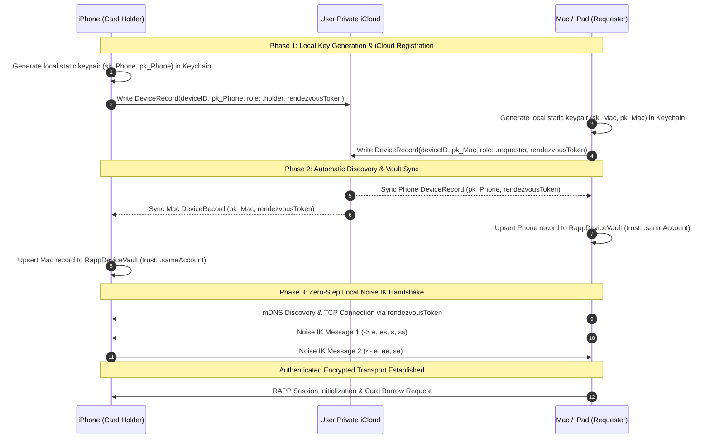

# Automatic & Secure Same-AppleID Device Pairing

## 1. Executive Summary

This document specifies the architecture, cryptographic protocol, security model, and implementation roadmap for **Automatic & Secure Same-AppleID Device Pairing** in RefineID.

When a user has the RefineID card installed/read on their iPhone, any Mac or iPad signed into the same Apple ID will automatically and securely discover and pair with the iPhone upon opening the app—**with zero manual pairing code entry**, while preserving strict end-to-end cryptographic boundaries and hardware-backed card security.

---

## 2. Security Guarantees & Threat Model

### 2.1 Core Security Invariants
1. **Private Keys Never Sync**:
   - Every device generates its own static Curve25519 / Ed25519 keypair in its local Data Protection Keychain (`kSecAttrAccessibleAfterFirstUnlockThisDeviceOnly`).
   - Private keys **never** leave the originating device and are **never** synced to iCloud or transferred across the network.
2. **Authenticated Key Distribution via Private iCloud**:
   - Only public keys ($pk_A, pk_B$), device metadata (name, model, role), and rotating rendezvous tokens sync across the user's private iCloud container (`NSUbiquitousKeyValueStore` / private CloudKit database).
   - Because the iCloud container is private to the user's Apple ID account, third parties and off-path attackers cannot inject or substitute public keys.
3. **Pre-Authenticated Mutual Noise Handshake (Noise IK)**:
   - Instead of an interactive passkey/PIN (Noise XXpsk3), same-account devices execute a **Noise IK** handshake (Initiator knows Responder's static public key beforehand).
   - Provides full mutual authentication, forward secrecy for session traffic, and replay protection.
4. **Card Authorization Boundary Preserved**:
   - The card-holding iPhone remains the authoritative gatekeeper for the physical smartcard.
   - Operations requiring explicit user confirmation (e.g. signature PIN 2 / biometric authorization prompt) continue to execute on the iPhone holding the card.

---

## 3. Cryptographic Protocol & Handshake



### 3.1 Noise IK Handshake Details
- **Pattern**: `Noise_IK_25519_ChaChaPoly_SHA256`
- **Message 1 (`Mac -> iPhone`)**:
  - `-> e, es, s, ss`
  - Ephemeral key $e$ generated by Mac.
  - Diffie-Hellman $es = \text{DH}(e, pk_{\text{Phone}})$.
  - Mac static public key $s$ encrypted with key derived from $es$.
  - Diffie-Hellman $ss = \text{DH}(sk_{\text{Mac}}, pk_{\text{Phone}})$.
- **Message 2 (`iPhone -> Mac`)**:
  - `<- e, ee, se`
  - Ephemeral key $e$ generated by iPhone.
  - Diffie-Hellman $ee = \text{DH}(e, e_{\text{Mac}})$.
  - Diffie-Hellman $se = \text{DH}(sk_{\text{Phone}}, e_{\text{Mac}})$.
- **Output**:
  - Mutual symmetric cipher states ($k_1, k_2$) for streaming APDUs and RAPP framing.
  - Zero round-trip user friction.

---

## 4. Architecture, Device Priority & Multi-Device Topology

### 4.1 Card Reader Priority & Seamless Fallback
When an application or Safari requests smartcard services on a Mac or iPad, RefineID applies a strict hardware-first arbitration order:
1. **Priority 1 (Direct Physical Reader)**:
   - If a physical smart card reader (USB-C, CCID, or built-in reader) is connected and contains a card, CryptoTokenKit and the app communicate directly with the local card.
2. **Priority 2 (Automatic Fallback to Paired iPhone)**:
   - If no physical card is detected locally, RefineID transparently routes the request to the auto-paired iPhone holding the identity over RAPP.

### 4.2 Multi-Device Topology (1:N Simultaneous Pairing)
- **Standing Multi-Device Trust**: One card-holding iPhone can be simultaneously paired with multiple requesting devices (e.g. both a MacBook Pro and an iPad Pro).
- **Session Multiplexing**: The iPhone's local listener (`NWListener`) accepts incoming connections from both devices, serializing any physical NFC/card transactions so each device has instantaneous access.

### 4.3 iCloud Device Record (`RappCloudDeviceRecord`)
```swift
public struct RappCloudDeviceRecord: Codable, Sendable, Identifiable {
  public let id: UUID                      // Device unique identifier
  public let modelName: String             // e.g. "MacBook Pro (16-inch, 2024)"
  public let deviceName: String            // e.g. "Petri's MacBook Pro"
  public let role: RappDeviceRole          // .holder | .requester
  public let staticPublicKey: Data         // 32-byte Curve25519 public key
  public let rendezvousToken: Data         // 32-byte shared mDNS discovery seed
  public let updatedAt: Date               // Timestamp for freshness/liveness
  public let appBuildVersion: String       // e.g. "26.8.24 (225)"
}
```

### 4.4 Synchronization Engine (`RappCloudSyncCoordinator`)
- Implemented in `CardCore/Sources/CardCore/RappCloudSyncCoordinator.swift`.
- Subscribes to `NSUbiquitousKeyValueStore.didChangeExternallyNotification`.
- Reads and publishes device registration payload under key `fi.refineid.rapp.devices`.
- Automatically populates and updates `RappDeviceVault` on local storage.
- Automatically initiates connection when an active card holder is detected on the same local network / WiFi.

---

## 5. Unrelated & Cross-OS Device Pairing (Android, Windows, Linux, Cross-Account)

For devices that **do not share an Apple ID** (e.g. pairing an Android phone with a Mac/iPad, or sharing across different user accounts), zero-step iCloud distribution is unavailable. RefineID uses clean 6-digit numeric pairing:

### 5.1 6-Digit Numeric Pairing Code
1. **Offer Generation**:
   - The card holder displays a 6-digit numeric pairing code (e.g. `482 915`) with a 180s TTL.
2. **Key Exchange (Noise XXpsk3)**:
   - The requesting device (Android, Linux, Windows, Mac, iPad) enters the 6-digit code.
   - Devices execute the Noise XXpsk3 handshake over the local network with SHA-256 transcript mixing and permanently vault the static keys in `RappDeviceVault`.
   - **All subsequent reconnections occur silently and automatically without entering the code again.**

---

## 6. Phased Implementation Plan

### Phase 1: Storage & Cloud Synchronization Layer
- [ ] Define `RappCloudDeviceRecord` and `RappCloudSyncCoordinator` using `NSUbiquitousKeyValueStore`.
- [ ] Add iCloud entitlement (`com.apple.developer.ubiquity-kvstore-identifier`) to iOS and macOS targets.
- [ ] Integrate `RappCloudSyncCoordinator` with `RappDeviceVault` to auto-import trusted same-account peers.

### Phase 2: Reader Priority Arbitration & Noise IK Handshake
- [ ] Implement reader arbitration logic in `CardCore`: Prefer local physical smart card if present; fallback to auto-paired RAPP iPhone if absent.
- [ ] Implement `Noise_IK_25519_ChaChaPoly_SHA256` pattern in `CardCore` alongside existing `Noise_XXpsk3`.
- [ ] Auto-negotiate Noise IK for same-account peers.

### Phase 3: Automatic Background Discovery & Connection
- [ ] Monitor network reachability and mDNS advertisements for same-account `rendezvousToken` hashes.
- [ ] Auto-dial the card-holding iPhone when Mac or iPad app opens and requests smart card operations.
- [ ] Reconnection & self-healing management when roaming across networks.

### Phase 4: Cross-OS 6-Digit Code Pairing & Verification
- [x] Implement 6-digit numeric pairing code with Noise XXpsk3 handshake for cross-OS pairing.
- [x] Qualified and verified cross-platform interoperability across Android - Mac, Android - Linux, Mac - iPhone, Mac - Android, Linux - Android, and Windows.
- [x] Unit & integration tests for multi-device topology (Mac + iPad simultaneously connected to 1 iPhone).
- [ ] Formal release candidate archive qualification.
